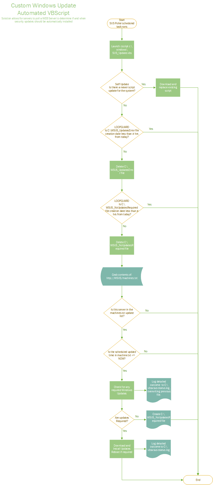

# wsus_pollerupdate
A polling task that centralizes and automates scheduled installation of windows updates via an existing WSUS server and a custom windows task installed on all workstations or servers.

A reasonably robust custom solution has been devised that may facilitate applying Windows updates with less effort and improved consistency and efficiency and quicker reporting.  The solution requires the “installation” of a VBScript and a scheduled Windows Task: “SUS Poller” for every system that needs to have windows updates automated.  Solution does not require any service accounts nor additional firewall rules and leverages existing WSUS infrastructure you have in place.  Once installed a configuration file managed by an administrator, located on a web server and published read-only (can be the WSUS Server) dictates which systems should install updates and at what approximate date and time this should occur.
## Installation:
An individual just copies the two files: SUS_update_installer.Cmd and SUS_update.vbs to a temporary location on the server to be managed.  Then rights clicks the SUS_Update_installer.cmd and executes as an administrator.  This copies the VBScript to the c:\windows directory and creates the “SUS Poller” scheduled task which runs every 15 minutes.  This can easily be performed via GPO, startup scripts or other deployment tools in place.
Finally, the administrator modifies a TXT file named machines.txt located on the WSUS server (or other globally accessible web server) with information concerning servers and the date/times (local to the time of individual servers) to install updates.  This is a simple file with one line for each server in the format:
Servername,mm/dd/yyyy hh:mm:ss  
* Note a special device entry of all in this file will result in all systems being subjected to update installs at the time specified for this particular entry. e.g. all,01/01/2030 01:30:00
The servers with the script and task scheduled will poll this file and within 15 minutes or less of the date and time specified will kick off the process of installing windows updates, restarting the server if required.  This process is then repeated within 15 minutes if updates are still required after reboot.
A workstation version of the script that includes delayed automated reboot as well as end user notifications via native windows balloon tips notification has been posted.  The server script assumes any automated reboots should occur immediately and without any end user notification.
This is a complete product but could be polished a bit more to get rid of some useless code and build in some additional safeguards against administrators doing potentially stupid things like scheduling updates during business hours.  Take a look at the visio flow chart of the logic of how this would work.

